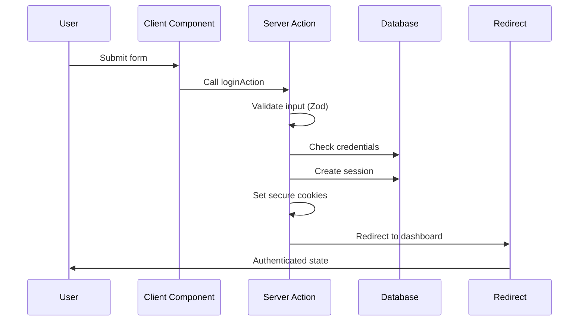
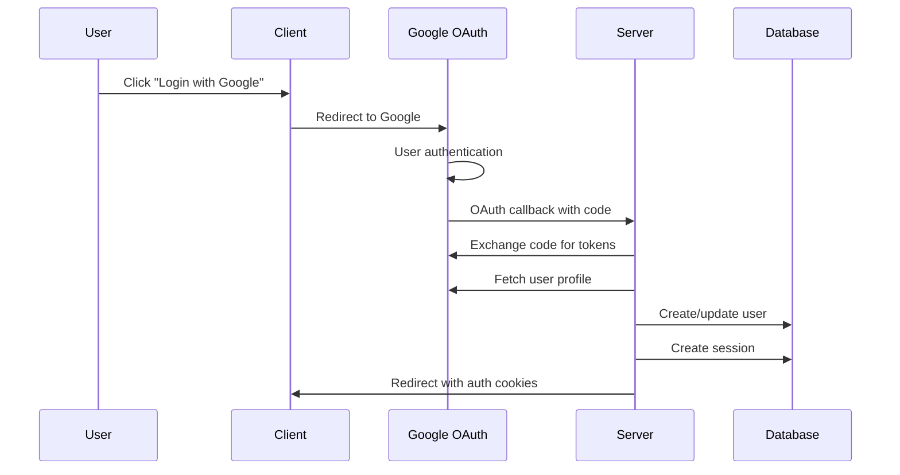

# Tamatar - Next.js Enterprise Authentication

## 🚀 Project Overview

**Tamatar** is a cutting-edge authentication system built with **Next.js 15**, showcasing modern full-stack development patterns. This implementation leverages the latest React 19 features, Server Actions, and the App Router to create a performant, type-safe authentication experience that demonstrates enterprise-level architecture and security practices.

## 🏗️ Architecture & Design Philosophy

### Next.js 15 App Router Architecture

The project utilizes the latest Next.js 15 features with a focus on Server Components and Server Actions:

```
src/
├── app/                    # Next.js App Router
│   ├── (auth)/            # Auth route group
│   │   ├── login/         # Login page
│   │   ├── signup/        # Registration page
│   │   └── layout.tsx     # Auth layout
│   ├── dashboard/         # Protected routes
│   ├── globals.css        # Global styles
│   ├── layout.tsx         # Root layout
│   └── page.tsx           # Homepage
├── components/            # Reusable components
│   ├── ui/               # shadcn/ui components
│   └── form.tsx          # Form components
├── lib/                  # Utilities and configurations
│   ├── db/              # Database utilities
│   ├── email/           # Email services
│   └── utils.ts         # Helper functions
└── types/               # TypeScript type definitions
```

### Key Architectural Decisions

1. **Server-First Approach**: Leveraging Server Components and Server Actions for optimal performance
2. **Type Safety**: End-to-end TypeScript with Zod schemas for validation
3. **Component-Based Design**: Modular UI components with shadcn/ui
4. **Security-First**: Secure cookie handling and JWT token management

## 🏗️ Architecture & Design Philosophy

### Modern Next.js Architecture

The project utilizes Next.js 15's most advanced features:

```
src/
├── app/
│   ├── (auth)/                 # Auth route group
│   │   ├── (routes)/          # Auth pages (login, signup, etc.)
│   │   ├── components/        # Auth-specific components
│   │   ├── utils/            # Auth utilities
│   │   └── layout.tsx        # Auth layout
│   ├── dashboard/            # Protected dashboard
│   ├── globals.css          # Global styles
│   ├── layout.tsx           # Root layout
│   ├── page.tsx            # Homepage
│   └── providers.tsx       # App providers
├── components/
│   └── ui/                 # shadcn/ui components
├── lib/
│   ├── db/                # Database operations
│   ├── email/             # Email utilities
│   └── utils.ts          # Shared utilities
├── types/                # TypeScript type definitions
└── utils/               # Utility functions
```

### Key Architectural Decisions

1. **Server-First Approach**: Utilizing Server Actions for form processing and data mutations
2. **Type Safety**: End-to-end TypeScript with Zod validation and Server Actions
3. **Performance Optimization**: Server Components, Turbopack, and intelligent caching
4. **Modern State Management**: Jotai for atomic state with TanStack Query integration
5. **Security-First Design**: Secure cookies, CSRF protection, and input validation

## 🔐 Authentication System Deep Dive

### Core Authentication Features

#### 1. **Server Actions Integration**

```typescript
// Server Action for login with comprehensive error handling
export async function loginAction(
    prev: FormActionReturn<void | { context: string }> | null,
    formData: FormData,
): Promise<FormActionReturn<void | { context: string }>> {
    try {
        // 1. Validate form input against schema
        const validationResult = validateForm(formData, loginSchema);
        if (!validationResult.success) {
            return { success: false, error: validationResult.error };
        }

        // 2. Check user existence and validate credentials
        const user = await getUserByEmail(email);
        const isPasswordValid = await comparePassword(password, user.password);

        // 3. Setup secure session
        await setupSession(user.id, userAgent);

        return { success: true };
    } catch (error) {
        return handleAppError(error);
    }
}
```

#### 2. **Database Schema Design**

```prisma
model User {
  id            String    @id @default(cuid())
  firstName     String?
  lastName      String?
  email         String    @unique
  password      String?
  verifiedEmail Boolean?  @default(false)
  username      String    @unique @default(nanoid(8))
  googleId      String?   @unique
  picture       String?
  role          Role      @default(USER)
  sessions      Session[]
  otps          Otp[]
  links         Link[]
  tags          Tag[]
}

model Session {
  id        String   @id @default(cuid())
  userId    String
  user      User     @relation(fields: [userId], references: [id], onDelete: Cascade)
  isValid   Boolean  @default(true)
  userAgent String?
  expiresAt DateTime
}
```

#### 3. **Enhanced Security Implementation**

```typescript
// Comprehensive error handling with logging
export function handleAppError(error: unknown): FormActionReturn<never> {
    const log = logger.child({ function: 'handleAppError' });

    if (error instanceof AppError) {
        log.warn(
            { error: error.message, code: error.code },
            'Application error occurred',
        );
        return {
            success: false,
            error: { message: error.message, code: error.code },
        };
    }

    log.error({ error }, 'Unexpected error occurred');
    return {
        success: false,
        error: {
            message: 'An unexpected error occurred',
            code: 'INTERNAL_ERROR',
        },
    };
}
```

### Authentication Flow Features

#### 1. **Multi-Authentication Methods**

- **Email/Password**: Server Action-based credential authentication
- **Google OAuth**: Seamless social login with profile sync
- **Email Verification**: OTP system with React Email templates
- **Password Reset**: Secure recovery flow with time-limited tokens

#### 2. **Session Management**

```typescript
// Secure session setup with JWT and database persistence
export async function setupSession(
    userId: string,
    userAgent?: string,
): Promise<void> {
    // Create database session
    const session = await createSession({
        userId,
        userAgent,
        expiresAt: new Date(Date.now() + REFRESH_TOKEN_EXPIRY),
    });

    // Generate JWT access token
    const accessToken = await createToken({
        payload: { sub: userId },
        expiresInMinutes: ACCESS_TOKEN_EXPIRY_IN_MINUTES,
    });

    // Set secure HTTP-only cookies
    setAuthCookie(accessToken, session.id);
}
```

#### 3. **Form Validation & Error Handling**

```typescript
// Zod schema validation with detailed error messages
export const loginSchema = z.object({
    email: z.string().trim().email('Please enter a valid email address'),
    password: z
        .string()
        .trim()
        .min(8, 'Password must be at least 8 characters'),
});

// Form validation utility
export function validateForm<T>(formData: FormData, schema: z.ZodSchema<T>) {
    try {
        const data = schema.parse(Object.fromEntries(formData));
        return { success: true as const, data };
    } catch (error) {
        if (error instanceof z.ZodError) {
            return {
                success: false as const,
                error: {
                    message: 'Validation failed',
                    fieldErrors: error.flatten().fieldErrors,
                },
            };
        }
        throw error;
    }
}
```

## 🎯 Frontend Architecture

### React 19 + Next.js 15 Implementation

#### 1. **Server Components & Client Components**

```tsx
// Server Component for initial data fetching
export default async function LoginPage() {
    return (
        <div className="container mx-auto max-w-md">
            <AuthFormContainer>
                <LoginForm />
            </AuthFormContainer>
        </div>
    );
}

// Client Component for interactive form
('use client');
export function LoginForm() {
    const [state, action] = useActionState(loginAction, null);

    return <form action={action}>{/* Form fields with validation */}</form>;
}
```

#### 2. **State Management with Jotai**

```typescript
// Atomic state management for auth
export const userAtom = atom<User | null>(null);
export const isAuthenticatedAtom = atom((get) => get(userAtom) !== null);

// Server Actions integration for client state
export const useAuthState = () => {
    const [user, setUser] = useState(null);

    useEffect(() => {
        // Get user from server-side session
        getCurrentUser().then(setUser);
    }, []);

    return user;
};
```

#### 3. **Server Actions & Form Handling**

```typescript
// Server Action for authentication
export async function authenticateUser(formData: FormData) {
  const validationResult = validateForm(formData, loginSchema);

  if (!validationResult.success) {
    return { success: false, error: validationResult.error };
  }

  // Process authentication logic
  const result = await processLogin(validationResult.data);

  if (result.success) {
    await setupSession(result.user.id);
    redirect('/dashboard');
  }

  return result;
}

// Client-side form handling with Server Actions
export function LoginForm() {
  const [formState, formAction] = useActionState(authenticateUser, null);

  return (
    <form action={formAction}>
      <input name="email" type="email" required />
      <input name="password" type="password" required />
      <button type="submit">Login</button>
      {formState?.error && <p>{formState.error}</p>}
    </form>
  );
}
```

### UI/UX Implementation

#### 1. **shadcn/ui Integration**

```tsx
// Modern form components with validation
<Form {...form}>
    <FormField
        control={form.control}
        name="email"
        render={({ field }) => (
            <FormItem>
                <FormLabel>Email</FormLabel>
                <FormControl>
                    <Input
                        type="email"
                        placeholder="Enter your email"
                        {...field}
                    />
                </FormControl>
                <FormMessage />
            </FormItem>
        )}
    />
</Form>
```

#### 2. **Animation & Interactions**

```tsx
// Framer Motion animations for smooth UX
<motion.div
    initial={{ opacity: 0, y: 20 }}
    animate={{ opacity: 1, y: 0 }}
    transition={{ duration: 0.3 }}
>
    <AuthForm />
</motion.div>
```

## 🛠️ Technical Stack & Tools

### Next.js 15 Features

- **App Router**: File-based routing with layouts and route groups
- **Server Actions**: Form handling without API routes
- **Server Components**: Optimal rendering performance
- **Turbopack**: Fast bundling and hot reload
- **React 19**: Latest React features and improvements

### Backend Technologies

- **Server Actions**: Form processing without API routes
- **Prisma ORM**: Database operations with type safety
- **JWT**: Secure token-based authentication
- **React Email**: Email templates with React components
- **Resend**: Reliable email delivery service
- **Pino**: Structured logging with performance monitoring

### Frontend Technologies

- **React Hook Form**: Form handling with validation
- **shadcn/ui**: Modern, accessible UI components
- **Tailwind CSS**: Utility-first styling
- **Framer Motion**: Smooth animations and transitions

### Development Tools

- **TypeScript**: Static type checking
- **Zod**: Runtime schema validation
- **ESLint**: Code linting and quality
- **Prettier**: Code formatting
- **Husky**: Git hooks for code quality

## 🔄 Authentication Flow Diagrams

### Server Action Authentication Flow



### OAuth Integration Flow



## 🎨 Error Handling & User Experience

### Comprehensive Error System

#### 1. **Error Types & Handling**

```typescript
export enum ErrorCode {
    UNAUTHORIZED = 'UNAUTHORIZED',
    FORBIDDEN = 'FORBIDDEN',
    NOT_FOUND = 'NOT_FOUND',
    CONFLICT = 'CONFLICT',
    INVALID_INPUT = 'INVALID_INPUT',
    UNVERIFIED_EMAIL = 'UNVERIFIED_EMAIL',
    INTERNAL_ERROR = 'INTERNAL_ERROR',
}

export class AppError extends Error {
    constructor(
        message: string,
        public code: ErrorCode,
        public statusCode: number = 400,
    ) {
        super(message);
        this.name = 'AppError';
    }
}
```

#### 2. **Form Error Display**

```tsx
// Server Action error handling in forms
export function LoginForm() {
    const [state, action] = useActionState(loginAction, null);

    return (
        <form action={action}>
            {state?.error && (
                <Alert variant="destructive">
                    <AlertCircle className="h-4 w-4" />
                    <AlertDescription>{state.error.message}</AlertDescription>
                </Alert>
            )}
            {/* Form fields */}
        </form>
    );
}
```

#### 3. **Global Error Boundary**

```tsx
// Error boundary for unexpected errors
export function GlobalErrorBoundary({ error }: { error: Error }) {
    return (
        <div className="flex min-h-screen flex-col items-center justify-center">
            <h1 className="text-2xl font-bold">Something went wrong!</h1>
            <p className="text-muted-foreground">{error.message}</p>
            <Button onClick={() => window.location.reload()}>Try again</Button>
        </div>
    );
}
```

## 🚀 Performance & Optimization

### Next.js 15 Optimizations

- **Server Components**: Reduced JavaScript bundle size
- **Streaming**: Progressive page loading with Suspense
- **Image Optimization**: Automatic image optimization and lazy loading
- **Bundle Analysis**: Code splitting and tree shaking
- **Edge Runtime**: Fast cold starts for API routes

### Database Optimizations

- **Connection Pooling**: Efficient database connections
- **Query Optimization**: Strategic indexes and efficient queries
- **Caching Strategy**: Redis-based caching for frequently accessed data
- **Database Migrations**: Versioned schema changes

### Frontend Performance

- **Route Prefetching**: Intelligent prefetching of critical routes
- **Component Lazy Loading**: Dynamic imports for non-critical components
- **Asset Optimization**: Optimized CSS and JavaScript delivery
- **Service Worker**: Offline support and caching strategies

## 🔒 Security Measures

### Authentication Security

1. **Secure Cookies**: HTTP-only, secure, SameSite cookies
2. **CSRF Protection**: Double-submit cookie pattern
3. **Rate Limiting**: Login attempt throttling
4. **Session Validation**: Server-side session verification
5. **Password Security**: Bcrypt hashing with salt rounds

### Data Protection

1. **Input Sanitization**: Comprehensive validation with Zod
2. **SQL Injection Prevention**: Prisma ORM parameterized queries
3. **XSS Prevention**: React's built-in XSS protection
4. **Content Security Policy**: Strict CSP headers
5. **Secure Headers**: HSTS, X-Frame-Options, etc.

### API Security

1. **Authentication Middleware**: JWT token validation
2. **Authorization Checks**: Role-based access control
3. **Request Validation**: Schema validation for all inputs
4. **Error Sanitization**: Prevent information leakage
5. **Audit Logging**: Comprehensive security event logging

## 📊 Monitoring & Observability

### Logging System

- **Structured Logging**: JSON-formatted logs with Pino
- **Request Tracing**: Correlation IDs for request tracking
- **Performance Metrics**: Response times and error rates
- **Security Events**: Authentication and authorization logging

### Health Monitoring

- **Database Health**: Connection status and query performance
- **API Health**: Endpoint availability and response times
- **Email Service**: Delivery status and bounce tracking
- **Error Tracking**: Real-time error monitoring and alerting

## 🔧 Development Workflow

### Code Quality

- **TypeScript Strict Mode**: Maximum type safety
- **ESLint Configuration**: Comprehensive linting rules
- **Prettier Integration**: Consistent code formatting
- **Git Hooks**: Pre-commit validation and testing
- **Automated Testing**: Unit, integration, and E2E tests

### Deployment Strategy

- **Environment Configuration**: Secure environment variable management
- **Database Migrations**: Automated schema updates
- **CI/CD Pipeline**: Automated testing and deployment
- **Performance Monitoring**: Production performance tracking
- **Error Reporting**: Real-time error tracking and alerts

## 🎯 Key Learning Outcomes

### Next.js 15 Mastery

1. **App Router**: Advanced routing patterns and layouts
2. **Server Actions**: Form handling without API routes
3. **Server Components**: Optimal rendering strategies
4. **Performance Optimization**: Bundle splitting and caching
5. **Security Implementation**: Secure authentication patterns

### Modern React Patterns

1. **React 19 Features**: Latest hooks and concurrent features
2. **State Management**: Atomic state with Jotai
3. **Form Handling**: Advanced form patterns with validation
4. **Error Boundaries**: Comprehensive error handling
5. **Accessibility**: WCAG-compliant component design

### Full-Stack Architecture

1. **Type Safety**: End-to-end TypeScript implementation
2. **API Design**: Server Actions for type-safe server communication
3. **Database Design**: Efficient schema and query patterns
4. **Security**: Production-ready security measures
5. **Monitoring**: Comprehensive observability implementation

## 📈 Future Enhancements

### Planned Features

- **Multi-Factor Authentication**: TOTP and SMS-based 2FA
- **Advanced Role Management**: Granular permission system
- **Real-time Features**: WebSocket integration for live updates
- **API Rate Limiting**: Advanced throttling strategies
- **Analytics Dashboard**: User behavior and system metrics

### Performance Improvements

- **Edge Functions**: Serverless functions at the edge
- **CDN Integration**: Global content delivery
- **Database Sharding**: Horizontal scaling strategies
- **Caching Layers**: Multi-level caching architecture
- **Progressive Web App**: PWA features for mobile experience

---

## 🏆 Project Impact

This Next.js implementation showcases mastery of modern web development practices, demonstrating the ability to build enterprise-grade applications with the latest technologies. The comprehensive approach to authentication, performance, and user experience makes this project an excellent reference for production-ready Next.js applications.

The combination of Server Actions, Next.js 15 features, and modern React patterns creates a development experience that is both powerful and maintainable, perfect for scaling teams and complex applications.
