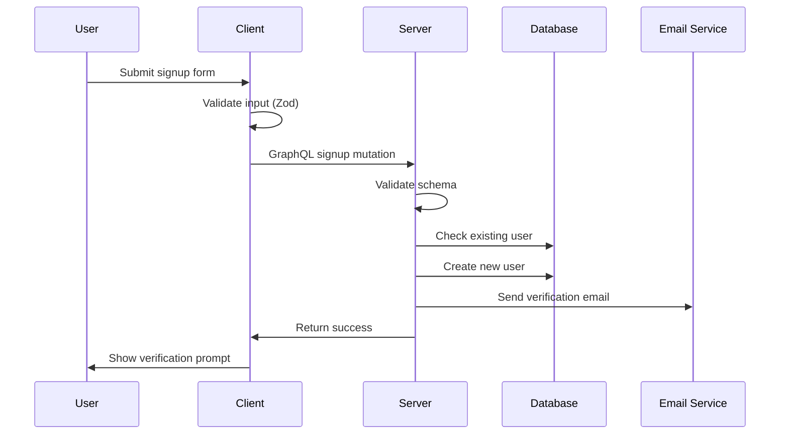
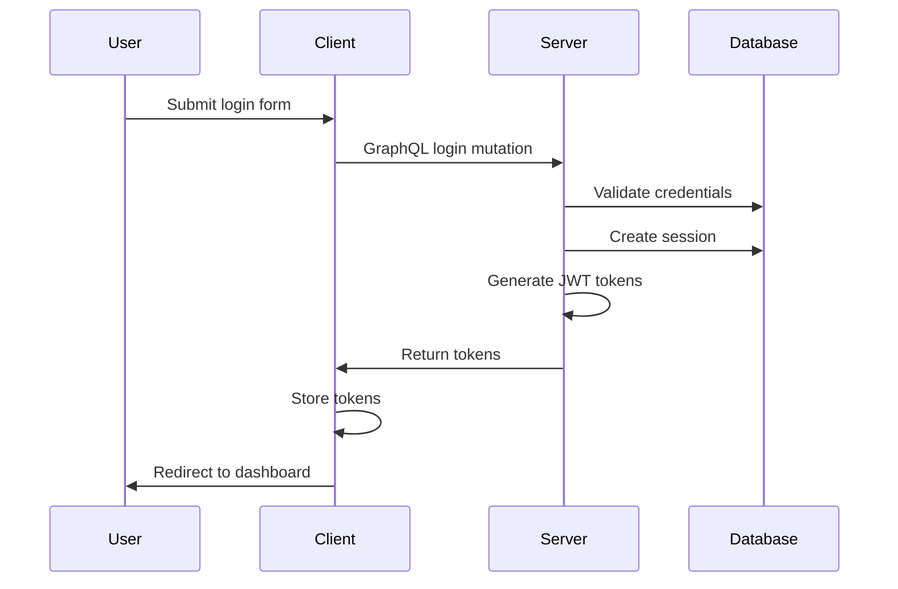

# Tamatar - Enterprise Authentication System

## 🚀 Project Overview

**Tamatar** is a comprehensive, enterprise-grade authentication system built with modern TypeScript technologies. The project demonstrates advanced full-stack development practices, featuring a modular monorepo architecture, type-safe GraphQL API, and robust authentication flows including JWT tokens, OAuth integration, and email verification.

## 🏗️ Architecture & Design Philosophy

### Monorepo Structure
The project utilizes a sophisticated monorepo architecture with clear separation of concerns:

```
tamatar/
├── packages/
│   ├── client/          # React frontend with TanStack Router
│   ├── server/          # GraphQL API with Bun runtime
│   └── shared/          # Shared schemas and constants
├── package.json         # Root workspace configuration
└── pnpm-workspace.yaml  # PNPM workspace configuration
```

### Key Architectural Decisions

1. **Type Safety First**: End-to-end type safety using TypeScript, Zod schemas, and GraphQL code generation
2. **Modular Design**: Clear separation between client, server, and shared code
3. **Schema-Driven Development**: Shared Zod schemas ensure consistent validation across frontend and backend
4. **Database-First Approach**: Prisma ORM with PostgreSQL for robust data persistence

## 🔐 Authentication System Deep Dive

### Core Authentication Features

#### 1. **Multi-Authentication Methods**
- **Email/Password**: Traditional credential-based authentication
- **Google OAuth**: Seamless social login integration
- **Email Verification**: OTP-based email verification system
- **Password Reset**: Secure password recovery flow

#### 2. **Token Management**
```typescript
// JWT-based authentication with refresh tokens
const accessToken = await createToken({
  payload: { sub: user.data.id },
  expiresInMinutes: ACCESS_TOKEN_EXPIRY_IN_MINUTES,
});

// Session-based refresh token management
const session = await createSession({
  user: { connect: { id: user.data.id } },
  expiresAt: new Date(Date.now() + REFRESH_TOKEN_EXPIRY_IN_MINUTES * 60 * 1000),
  userAgent: context.request.headers.get("user-agent"),
});
```

#### 3. **Database Schema Design**
```prisma
model User {
  id            String   @id @default(cuid())
  firstName     String
  lastName      String?
  email         String   @unique
  username      String   @unique
  googleId      String?  @unique
  picture       String?
  password      String?
  emailVerified Boolean  @default(false)
  role          Role     @default(USER)
  sessions      Session[]
  otps          Otp[]
}

model Session {
  id        String   @id @default(cuid())
  userId    String
  user      User     @relation(fields: [userId], references: [id], onDelete: Cascade)
  isValid   Boolean  @default(true)
  userAgent String?
  expiresAt DateTime
}
```

### Security Implementation

#### 1. **Input Validation & Sanitization**
```typescript
// Zod schema validation on both client and server
export const loginForm = z.object({
  email: z.string().trim().email("Invalid email format"),
  password: z.string().trim().min(8, "Password must be at least 8 characters long"),
});

// Server-side validation with Pothos GraphQL
builder.mutationField("login", (t) =>
  t.field({
    type: AuthPayload,
    validate: { schema: loginForm },
    resolve: async (_, { email, password }, context) => {
      // Secure authentication logic
    },
  }),
);
```

#### 2. **Error Handling System**
```typescript
// Custom AppError class for consistent error handling
export class AppError extends GraphQLError {
  constructor(message: string, { code, metadata, ...extensions }) {
    super(message, {
      extensions: { code, metadata, ...extensions },
    });
  }
}

// Usage throughout the application
throw new AppError("Invalid Credentials", {
  code: ErrorCode.UNAUTHORIZED,
});
```

#### 3. **Password Security**
- **Hashing**: Bcrypt for secure password hashing
- **Validation**: Complex password requirements enforced
- **Salt Rounds**: Configurable salt rounds for hashing strength

### OAuth Integration

#### Google OAuth Flow
```typescript
// Server-side Google OAuth verification
const res = await fetch("https://www.googleapis.com/oauth2/v3/userinfo", {
  method: "GET",
  headers: { Authorization: `Bearer ${token}` },
});

// User creation/update logic
const user = existingUser || await createUser({
  firstName: userInfo.given_name,
  lastName: userInfo.family_name,
  email: userInfo.email,
  googleId: userInfo.sub,
  picture: userInfo.picture,
  emailVerified: userInfo.email_verified,
});
```

## 🎯 Frontend Architecture

### React + TanStack Router Implementation

#### 1. **Route Protection**
```typescript
// Middleware-based route protection
export const authHeader = createMiddleware().client(({ next }) => {
  return next({
    headers: {
      Authorization: `Bearer ${useStore.getState().auth.accessToken}`,
    },
  });
});

// Hook-based authentication guard
export function useAuth({ from }: { from: LinkProps["from"] }) {
  const navigate = useNavigate();
  const accessToken = useStore((state) => state.auth.accessToken);
  if (!accessToken) {
    return navigate({ to: "/auth/login", search: { rdt: from } });
  }
  return true;
}
```

#### 2. **Form Management**
```typescript
// React Hook Form with Zod validation
const form = useForm<LoginSchema>({
  resolver: zodResolver(loginSchema),
  defaultValues: { email: "", password: "" },
});

// GraphQL mutation integration
const handleSubmit = async (data: LoginSchema) => {
  try {
    const result = await graphqlRequest(LoginQuery, data);
    // Handle success: store tokens, redirect user
  } catch (error) {
    // Handle errors: display user-friendly messages
  }
};
```

#### 3. **State Management**
- **Zustand**: Lightweight state management for auth state
- **TanStack Query**: Server state management with caching
- **Local Storage**: Persistent token storage

### UI/UX Design

#### 1. **Component Architecture**
- **Reusable Components**: Modular UI components with Tailwind CSS
- **Form Components**: Custom form fields with validation feedback
- **Loading States**: Comprehensive loading and error states

#### 2. **Responsive Design**
- **Mobile-First**: Responsive design with Tailwind CSS
- **Accessibility**: ARIA labels and keyboard navigation
- **Progressive Enhancement**: Works without JavaScript

## 🛠️ Technical Stack & Tools

### Backend Technologies
- **Runtime**: Bun (JavaScript runtime)
- **GraphQL**: Pothos schema builder
- **Database**: PostgreSQL with Prisma ORM
- **Authentication**: JWT tokens with JOSE library
- **Email**: React Email with Resend integration
- **Security**: GraphQL Armor for security hardening

### Frontend Technologies
- **Framework**: React 19 with TanStack Router
- **Styling**: Tailwind CSS with custom design system
- **Forms**: React Hook Form with Zod validation
- **State**: Zustand for global state management
- **HTTP**: GraphQL with gql.tada for type generation

### Development Tools
- **Language**: TypeScript for type safety
- **Package Manager**: PNPM with workspace support
- **Code Quality**: Biome for linting and formatting
- **Environment**: Doppler for secrets management

## 🔄 Authentication Flow Diagrams

### User Registration Flow


### Login Flow


## 🎨 Error Handling & User Experience

### Comprehensive Error System

#### 1. **Error Types**
```typescript
export enum ErrorCode {
  UNAUTHORIZED = "UNAUTHORIZED",
  FORBIDDEN = "FORBIDDEN",
  NOT_FOUND = "NOT_FOUND",
  CONFLICT = "CONFLICT",
  INVALID_INPUT = "INVALID_INPUT",
  UNVERIFIED_EMAIL = "UNVERIFIED_EMAIL",
  INTERNAL_ERROR = "INTERNAL_ERROR",
}
```

#### 2. **Client-Side Error Handling**
```typescript
// GraphQL error handling with user-friendly messages
const handleGraphQLError = (error: GraphQLError) => {
  const errorCode = error.extensions?.code;
  switch (errorCode) {
    case ErrorCode.UNVERIFIED_EMAIL:
      return "Please verify your email before logging in.";
    case ErrorCode.UNAUTHORIZED:
      return "Invalid email or password.";
    default:
      return "An unexpected error occurred.";
  }
};
```

#### 3. **Form Validation Feedback**
- **Real-time Validation**: Immediate feedback on form inputs
- **Field-Specific Errors**: Contextual error messages
- **Success States**: Clear confirmation of successful actions

## 🚀 Performance & Optimization

### Backend Optimizations
- **Database Indexing**: Strategic indexes on frequently queried fields
- **Query Optimization**: Efficient Prisma queries with proper relations
- **Caching Strategy**: Response caching with GraphQL Envelop
- **Connection Pooling**: Optimized database connections

### Frontend Optimizations
- **Code Splitting**: Route-based code splitting with TanStack Router
- **Bundle Optimization**: Tree shaking and dead code elimination
- **Image Optimization**: Responsive images with proper lazy loading
- **Prefetching**: Strategic prefetching of critical resources

## 🔒 Security Measures

### Authentication Security
1. **Token Security**: Short-lived access tokens with secure refresh mechanism
2. **Session Management**: Database-persisted sessions with expiration
3. **CSRF Protection**: Anti-CSRF measures for state-changing operations
4. **Rate Limiting**: GraphQL query complexity analysis and rate limiting

### Data Protection
1. **Input Sanitization**: Comprehensive input validation and sanitization
2. **SQL Injection Prevention**: Prisma ORM with parameterized queries
3. **XSS Prevention**: Proper output encoding and CSP headers
4. **Secure Headers**: Security headers for enhanced protection

## 📊 Monitoring & Observability

### Logging System
- **Structured Logging**: Pino logger with structured JSON output
- **Error Tracking**: Comprehensive error logging with context
- **Performance Monitoring**: Request timing and performance metrics
- **Audit Trails**: User action logging for security auditing

### Health Checks
- **Database Health**: Connection and query performance monitoring
- **API Health**: GraphQL endpoint health checks
- **Email Service**: Email delivery status monitoring

## 🔧 Development Workflow

### Code Quality
- **Type Safety**: Strict TypeScript configuration
- **Linting**: Biome for consistent code style
- **Testing**: Comprehensive test coverage (unit, integration, e2e)
- **Git Hooks**: Pre-commit hooks for code quality

### Deployment Strategy
- **Environment Management**: Doppler for secrets management
- **Database Migrations**: Prisma migrations with rollback support
- **CI/CD Pipeline**: Automated testing and deployment
- **Monitoring**: Production monitoring and alerting

## 🎯 Key Learning Outcomes

### Technical Skills Demonstrated
1. **Full-Stack Development**: End-to-end application development
2. **GraphQL Mastery**: Advanced GraphQL schema design and optimization
3. **Authentication Expertise**: Comprehensive auth system implementation
4. **Database Design**: Efficient database schema and query optimization
5. **Security Implementation**: Production-ready security measures

### Architecture Patterns
1. **Monorepo Management**: Effective workspace organization
2. **Modular Design**: Scalable and maintainable code structure
3. **Type Safety**: Compile-time error prevention
4. **Error Handling**: Graceful error handling and user feedback
5. **Performance Optimization**: Efficient resource utilization

## 📈 Future Enhancements

### Planned Features
- **Multi-Factor Authentication**: TOTP and SMS-based 2FA
- **Role-Based Access Control**: Granular permission system
- **Audit Logging**: Comprehensive user action tracking
- **API Rate Limiting**: Advanced rate limiting strategies
- **Real-time Notifications**: WebSocket-based notifications

### Scalability Improvements
- **Microservices Architecture**: Service decomposition for scale
- **Caching Layer**: Redis-based caching for performance
- **Load Balancing**: Horizontal scaling capabilities
- **Database Sharding**: Data partitioning strategies

---

## 🏆 Project Impact

This project showcases my ability to architect and implement enterprise-grade authentication systems with modern technologies. The comprehensive approach to security, performance, and user experience demonstrates my understanding of full-stack development best practices and my commitment to building production-ready applications.

The modular architecture and extensive documentation make this project an excellent reference for authentication implementation patterns and serve as a foundation for building scalable web applications.
