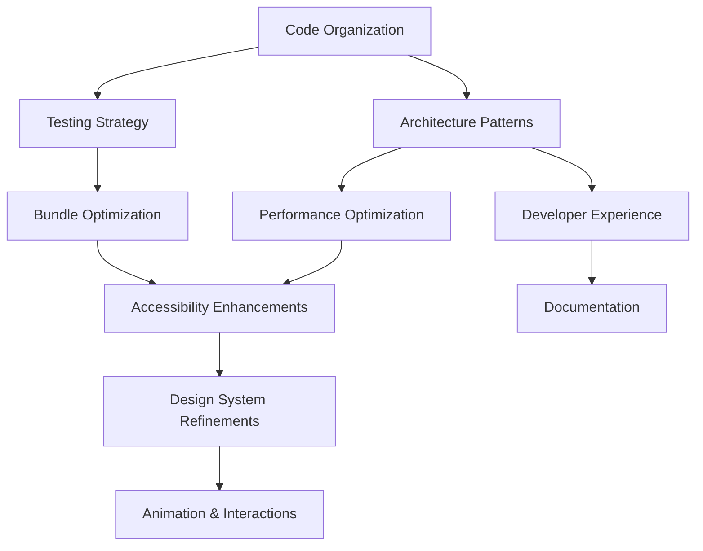

# Implementation Timeline & Priority Matrix

## 📅 Comprehensive Implementation Roadmap

This document provides a detailed timeline and priority matrix for implementing all improvement plans across the Tamatar frontend codebase.

## 🎯 Implementation Phases

### Phase 1: Foundation (Weeks 1-8)
**Goal**: Establish solid architecture, testing, and development foundations

#### Weeks 1-2: Project Setup & Organization
- **Code Organization** (01)
  - [ ] Implement folder restructuring
  - [ ] Create shared utilities and constants
  - [ ] Set up module boundaries
- **Developer Experience** (09)
  - [ ] Set up custom CLI tool
  - [ ] Create code generators
  - [ ] Configure development environment

#### Weeks 3-4: Architecture & Patterns  
- **Architecture Patterns** (02)
  - [ ] Implement state management (Zustand)
  - [ ] Create compound components
  - [ ] Set up error boundaries
- **Testing Strategy** (06)
  - [ ] Set up comprehensive testing framework
  - [ ] Create testing utilities and helpers
  - [ ] Implement automated testing pipeline

#### Weeks 5-6: Performance Foundation
- **Performance Optimization** (03)
  - [ ] Implement lazy loading strategies
  - [ ] Set up performance monitoring
  - [ ] Optimize critical rendering paths
- **Bundle Optimization** (04)
  - [ ] Configure advanced code splitting
  - [ ] Implement tree shaking optimizations
  - [ ] Set up performance budgets

#### Weeks 7-8: Documentation Foundation
- **Documentation** (10)
  - [ ] Set up Storybook
  - [ ] Create API documentation generation
  - [ ] Implement automated documentation updates

### Phase 2: Enhancement (Weeks 9-16)
**Goal**: Improve user experience, accessibility, and design consistency

#### Weeks 9-10: Design System
- **Design System Refinements** (07)
  - [ ] Implement centralized design tokens
  - [ ] Create consistent theme system
  - [ ] Standardize component APIs

#### Weeks 11-12: Accessibility
- **Accessibility Enhancements** (05)
  - [ ] Implement comprehensive WCAG compliance
  - [ ] Set up automated accessibility testing
  - [ ] Create accessibility documentation

#### Weeks 13-14: Advanced Performance
- **Performance Optimization** (03) - Advanced
  - [ ] Implement virtual scrolling
  - [ ] Optimize animation performance
  - [ ] Advanced caching strategies

#### Weeks 15-16: Developer Tools
- **Developer Experience** (09) - Advanced
  - [ ] Advanced debugging tools
  - [ ] Performance monitoring dashboard
  - [ ] Team workflow optimization

### Phase 3: Polish (Weeks 17-24)
**Goal**: Add delightful interactions, complete documentation, and advanced features

#### Weeks 17-18: Animations & Interactions
- **Animation & Interactions** (08)
  - [ ] Implement motion design system
  - [ ] Create micro-interactions
  - [ ] Advanced animation orchestration

#### Weeks 19-20: Advanced Architecture
- **Architecture Patterns** (02) - Advanced
  - [ ] Dependency injection system
  - [ ] Event-driven architecture
  - [ ] Advanced error handling

#### Weeks 21-22: Complete Testing
- **Testing Strategy** (06) - Advanced
  - [ ] Visual regression testing
  - [ ] Performance testing
  - [ ] Advanced E2E scenarios

#### Weeks 23-24: Final Polish
- **Documentation** (10) - Complete
  - [ ] Video tutorials
  - [ ] Interactive examples
  - [ ] Team training materials

## 📊 Priority Matrix

### High Impact, Low Effort (Quick Wins)
1. **Code Organization** - Folder restructuring
2. **Developer Experience** - CLI tools and generators
3. **Performance Optimization** - Basic lazy loading
4. **Testing Strategy** - Unit test setup

### High Impact, High Effort (Major Projects)
1. **Architecture Patterns** - State management overhaul
2. **Bundle Optimization** - Advanced splitting strategies
3. **Accessibility Enhancements** - Comprehensive WCAG compliance
4. **Design System Refinements** - Complete token system

### Low Impact, Low Effort (Minor Improvements)
1. **Documentation** - Basic Storybook setup
2. **Animation & Interactions** - Simple micro-interactions
3. **Performance Optimization** - Performance monitoring

### Low Impact, High Effort (Future Considerations)
1. **Architecture Patterns** - Dependency injection
2. **Animation & Interactions** - Complex orchestration
3. **Testing Strategy** - Advanced visual regression

## 🔄 Implementation Strategy

### Parallel Workstreams

#### Stream 1: Foundation Architecture
- Code Organization
- Architecture Patterns
- Performance Optimization

#### Stream 2: Quality & Testing
- Testing Strategy
- Accessibility Enhancements
- Documentation

#### Stream 3: User Experience
- Design System Refinements
- Animation & Interactions
- Developer Experience

### Dependencies & Prerequisites



## 📈 Success Metrics & KPIs

### Foundation Phase (Weeks 1-8)
- [ ] **Code Quality**: 90% TypeScript coverage
- [ ] **Testing**: 80% code coverage
- [ ] **Performance**: < 3s initial load time
- [ ] **Developer Experience**: < 5min new developer setup

### Enhancement Phase (Weeks 9-16)
- [ ] **Accessibility**: WCAG AA compliance
- [ ] **Design Consistency**: 95% component standardization
- [ ] **Performance**: Core Web Vitals in green
- [ ] **Bundle Size**: < 500KB gzipped

### Polish Phase (Weeks 17-24)
- [ ] **User Experience**: 90+ usability score
- [ ] **Animation Performance**: 60fps animations
- [ ] **Documentation**: 100% component coverage
- [ ] **Team Satisfaction**: 4.5/5 developer experience rating

## 🚨 Risk Mitigation

### Technical Risks
- **Breaking Changes**: Implement feature flags and gradual rollouts
- **Performance Regression**: Continuous performance monitoring
- **Compatibility Issues**: Comprehensive browser testing

### Resource Risks
- **Time Constraints**: Prioritize high-impact, low-effort improvements
- **Team Bandwidth**: Parallel workstreams with clear ownership
- **Knowledge Gaps**: Pair programming and knowledge sharing sessions

### Business Risks
- **User Disruption**: Backward compatibility and migration strategies
- **Feature Delays**: Clear communication and stakeholder alignment

## 🎯 Weekly Checkpoints

### Weekly Review Template
```markdown
## Week [X] Review

### Completed
- [ ] Task 1
- [ ] Task 2

### In Progress
- [ ] Task 3
- [ ] Task 4

### Blockers
- Issue 1: Description and resolution plan
- Issue 2: Description and resolution plan

### Next Week Priority
1. High priority task
2. Medium priority task
3. Low priority task

### Metrics Update
- Performance: [Current vs Target]
- Quality: [Current vs Target]
- Team Satisfaction: [Current vs Target]
```

## 🔧 Implementation Tools

### Project Management
- **Task Tracking**: GitHub Issues/Projects
- **Timeline Management**: Gantt charts
- **Communication**: Regular standups and reviews

### Development Tools
- **Code Quality**: ESLint, Prettier, SonarQube
- **Testing**: Vitest, Playwright, Storybook
- **Performance**: Lighthouse CI, Bundle Analyzer

### Monitoring & Analytics
- **Performance**: Web Vitals, New Relic
- **Error Tracking**: Sentry
- **Usage Analytics**: PostHog

## 📚 Resources & Documentation

### Learning Resources
- [React Best Practices](https://react.dev)
- [Accessibility Guidelines](https://www.w3.org/WAI/WCAG21/quickref/)
- [Performance Optimization](https://web.dev/fast/)

### Internal Documentation
- Architecture Decision Records (ADRs)
- Component Library Documentation
- Development Workflow Guides

## 🤝 Team Responsibilities

### Frontend Lead
- Architecture decisions and code reviews
- Performance optimization oversight
- Team mentoring and knowledge sharing

### Senior Developers
- Implementation of complex features
- Code quality and testing standards
- Junior developer guidance

### Junior Developers
- Component implementation
- Testing and documentation
- Learning and skill development

### UX/UI Designer
- Design system consistency
- Accessibility requirements
- User experience validation

This implementation timeline provides a structured approach to systematically improving the Tamatar frontend codebase while maintaining development velocity and code quality.
